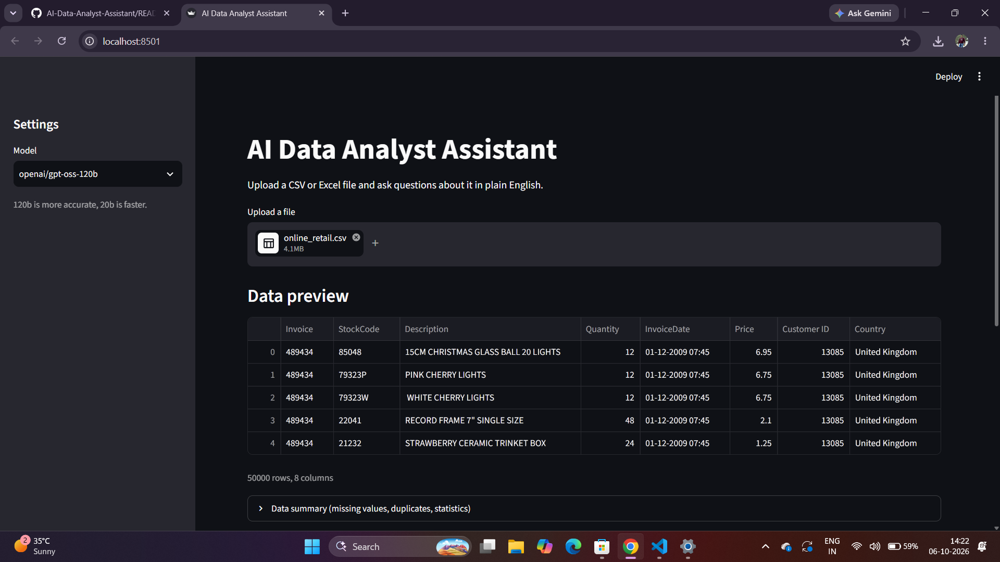
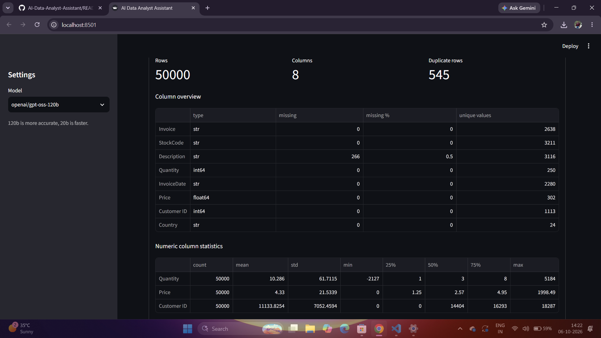
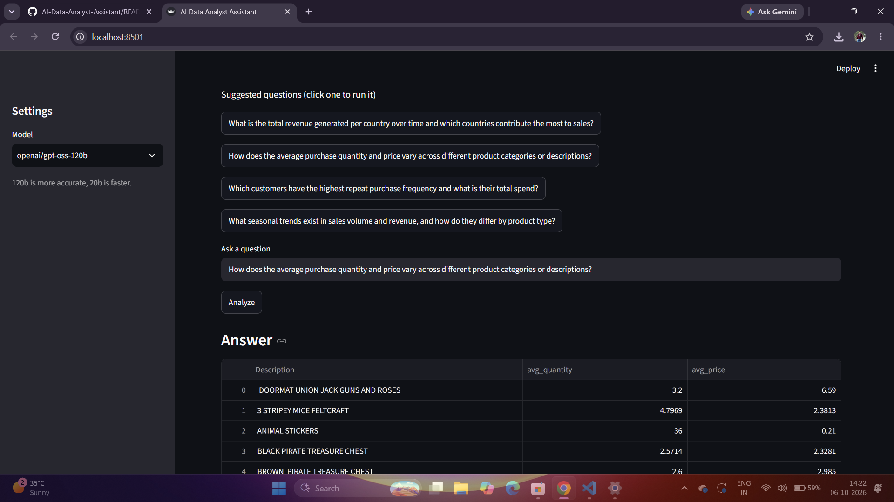
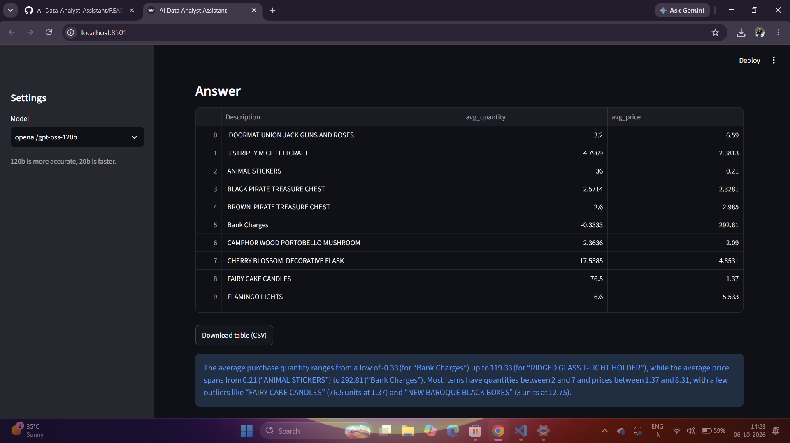
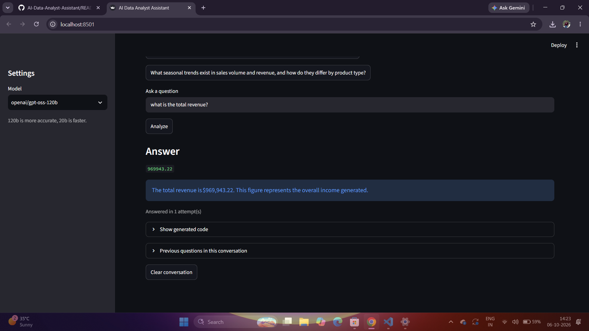
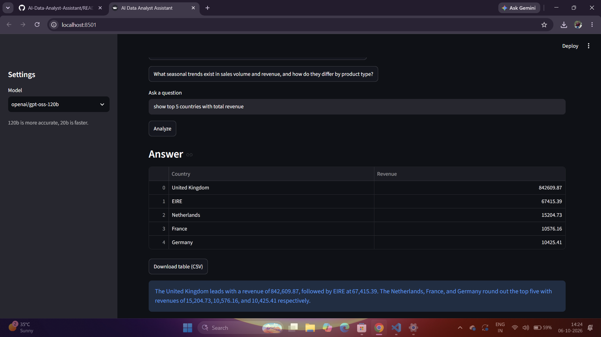
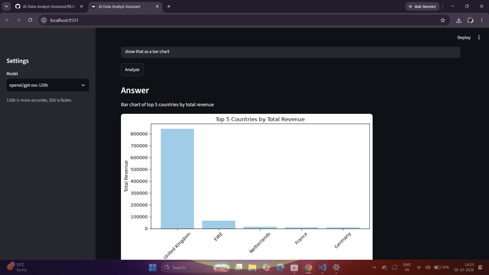
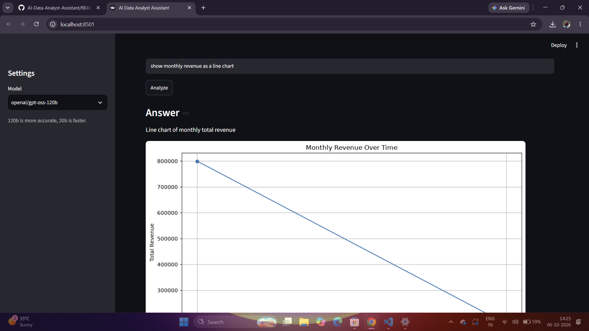
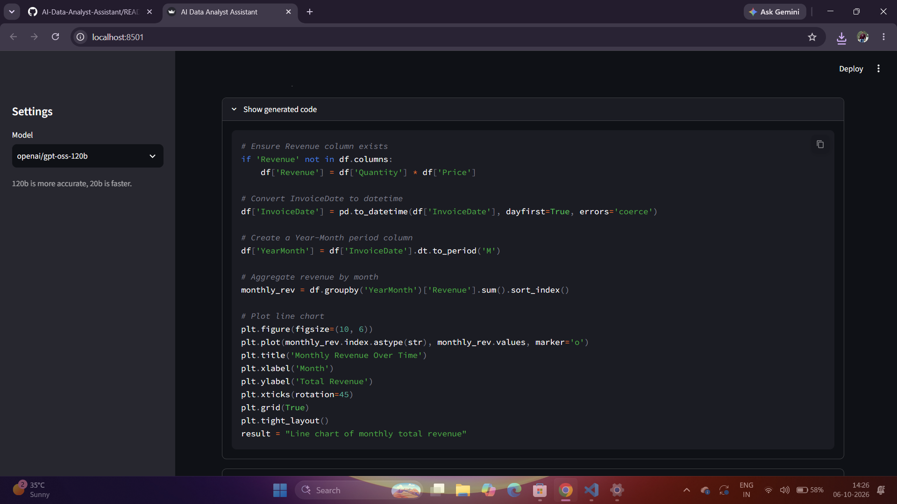
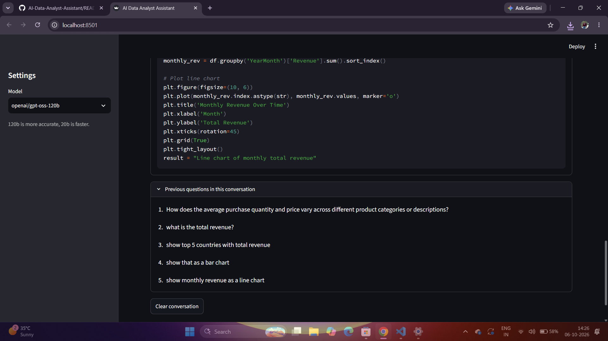

# AI Data Analyst Assistant

Upload a CSV or Excel file, ask questions about it in plain English, and get answers as tables, numbers or charts. An LLM writes the Pandas code, the app checks it and runs it, and explains the result in simple words.

## Demo
Tested on a 50,000-row sample of the Online Retail II dataset (Dec 2009 – Jan 2010).

### 1. Upload a file and preview the data


### 2. Automatic data summary


### 3. Suggested questions



### 4. Ask your own questions



### 5. Follow-up questions and charts



### 6. See the code and the conversation



## Features
- Ask questions in plain English (no code needed)
- Automatic data summary: missing values, duplicates, column types, statistics
- Suggested questions generated for each uploaded file
- Follow-up questions ("now show that by month")
- Charts and tables, with CSV / PNG download
- Retry loop: if the generated code fails, the error is sent back to the model to fix it
- Plain-English explanation under every answer
- Choice of model (gpt-oss-120b or gpt-oss-20b)

## How it works
1. The model only sees the column names, data types and 5 sample rows, never the full dataset.
2. It replies with Pandas code.
3. The code is checked against a list of blocked patterns (imports, file access, exec/eval, etc.).
4. It runs in a restricted environment where only the data, pandas, numpy and matplotlib are available.
5. If it fails, the error goes back to the model for up to 2 retries.

## Tech stack
Python, Pandas, NumPy, Matplotlib, Streamlit, Groq API (gpt-oss models)

## Results
Evaluation on a test set of questions is in progress and will be added here soon.

## Limitations
- The code check blocks risky patterns but is not a full security sandbox. Don't use it on a public server with sensitive data.
- The model can misread vague questions or pick the wrong column.
- Very large files may be slow.

## Run it locally
```
git clone https://github.com/bhavishyaaggarwal543/AI-Data-Analyst-Assistant.git
cd AI-Data-Analyst-Assistant
python -m venv venv
venv\Scripts\activate
pip install -r requirements.txt
setx GROQ_API_KEY "your-key-here"
streamlit run app.py
```
Restart your terminal after `setx`. Get a free key at console.groq.com.

## What I'd improve next
- Stronger sandboxing for the code execution
- Support for multiple tables
- A proper evaluation script that scores answers automatically
